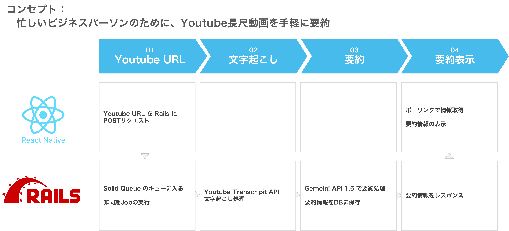
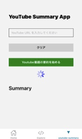
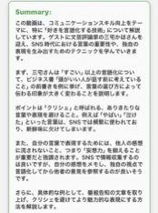
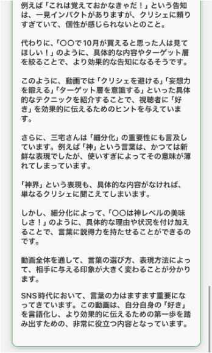

# YouTube Summary App

YouTube動画のURLを入力するだけで、AIが動画の内容を要約してくれるモバイルアプリです。

## コンセプト

**忙しいビジネスパーソンのために、YouTube長尺動画を手軽に要約**



## 機能

- YouTube URLを入力して動画の要約を取得
- 要約結果をクリップボードにコピー
- シンプルで直感的なUI

## スクリーンショット

| ホーム画面 | 要約結果（短） | 要約結果（長） |
|:---:|:---:|:---:|
|  |  |  |

## 技術スタック

### フロントエンド（このリポジトリ）
- **React Native** - クロスプラットフォームモバイルアプリ開発
- **Expo** (v51) - React Native開発プラットフォーム
- **TypeScript** - 型安全な開発
- **Expo Router** - ファイルベースルーティング

### バックエンド（別リポジトリ）
- **Ruby on Rails** - APIサーバー
- **Solid Queue** - 非同期ジョブ処理
- **YouTube Transcript API** - 動画の文字起こし取得
- **Gemini API 1.5** - AI要約処理

## アーキテクチャ

```
[React Native App] → POST /videos → [Rails API]
                                         ↓
                                   [Solid Queue]
                                         ↓
                               [YouTube Transcript API]
                                         ↓
                                  [Gemini API 1.5]
                                         ↓
[React Native App] ← Polling ← [Rails API + DB]
```

1. **YouTube URL送信**: ユーザーがURLを入力し、RailsサーバーにPOSTリクエスト
2. **非同期処理**: Solid Queueでジョブをキューイング
3. **文字起こし取得**: YouTube Transcript APIで動画のテキストを取得
4. **AI要約**: Gemini API 1.5で要約を生成しDBに保存
5. **結果取得**: フロントエンドがポーリングで要約結果を取得

## セットアップ

詳細な開発環境のセットアップ手順は [docs/development.md](docs/development.md) を参照してください。

### クイックスタート

```bash
# 依存関係のインストール
npm install

# 開発サーバーの起動
npx expo start
```

## 今後の改善予定

- [ ] エラーハンドリングの強化
- [ ] 要約履歴の保存機能
- [ ] ダークモード対応
- [ ] オフライン対応

## 関連リポジトリ

- バックエンドAPI: （別途リンクを追加）

## ライセンス

MIT License
